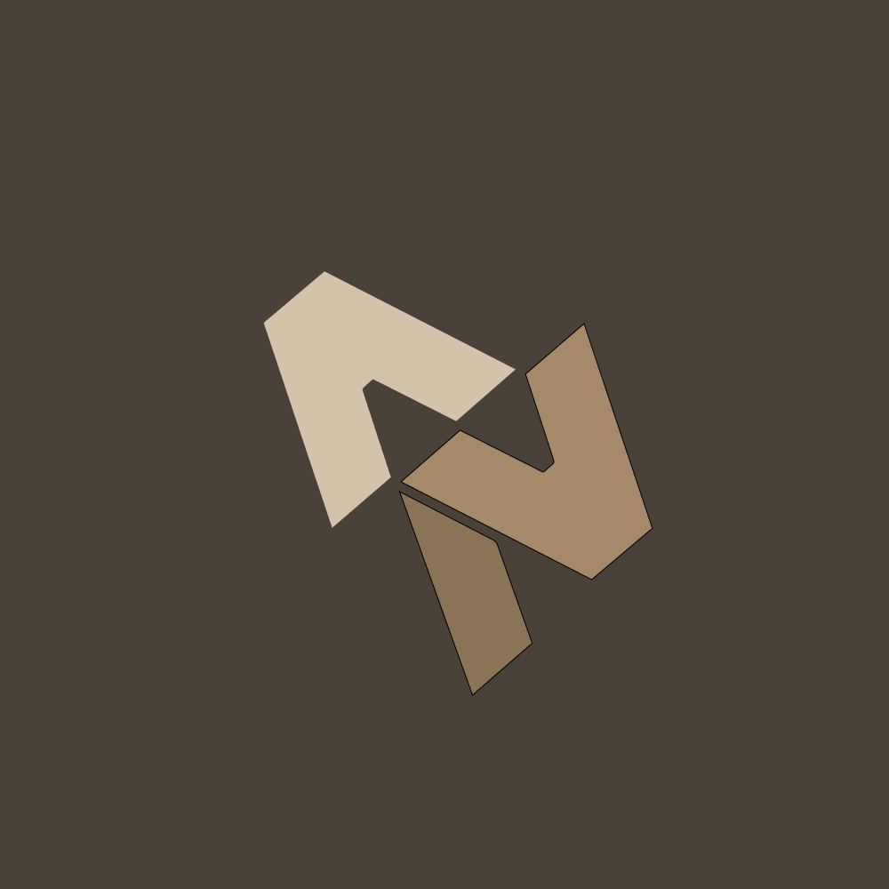
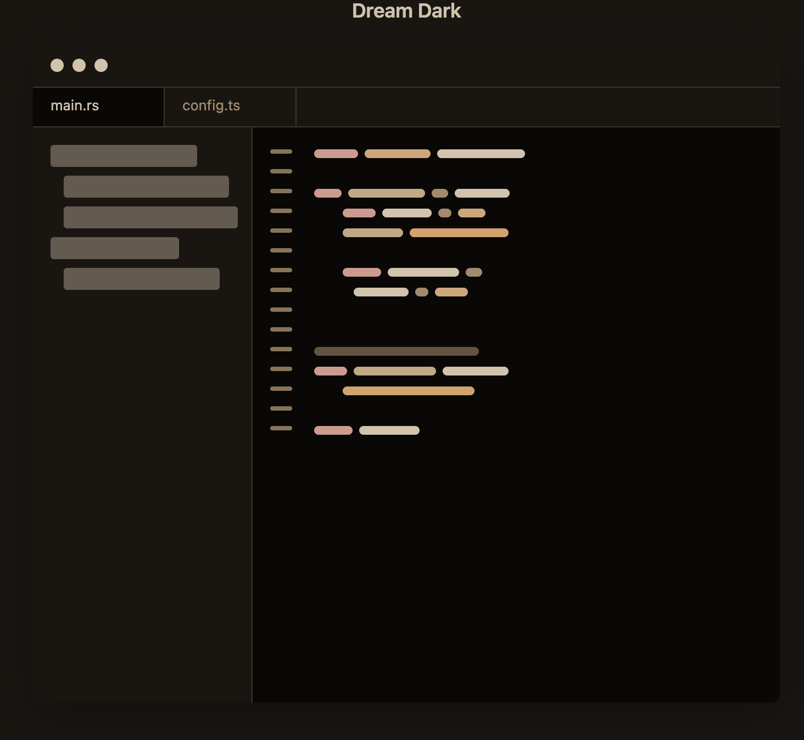
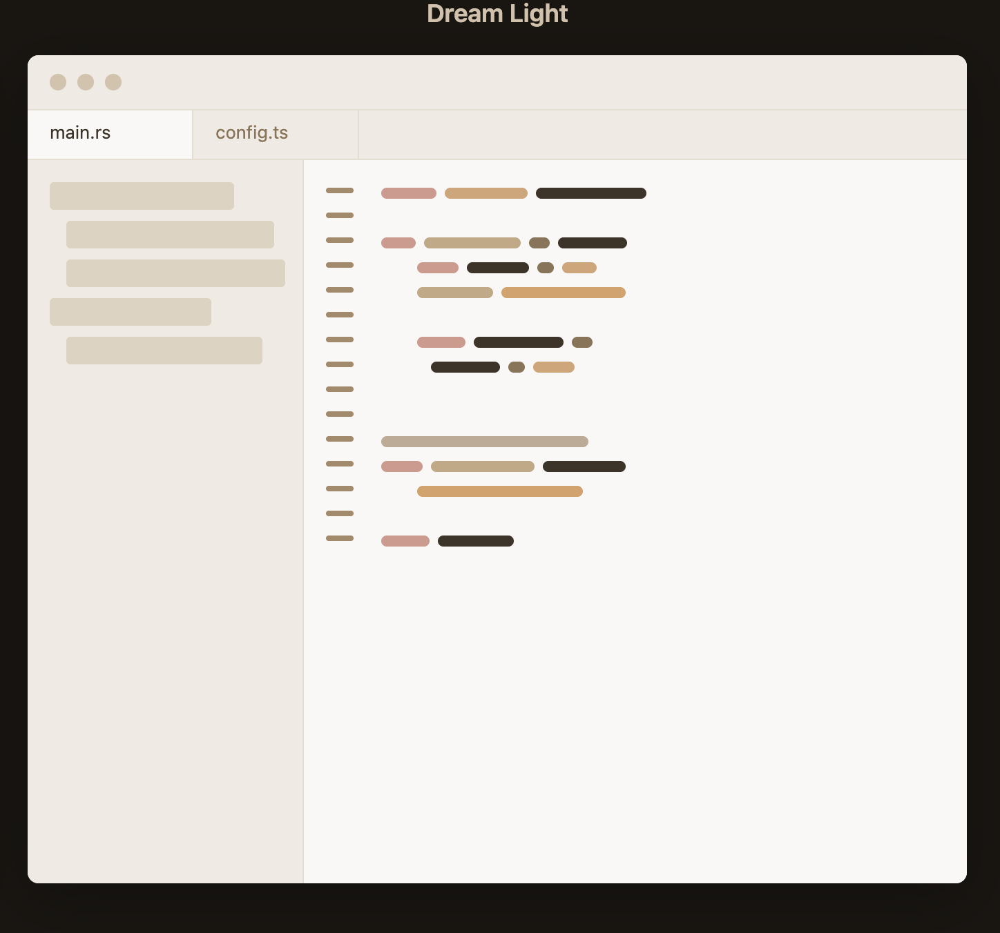

<h3 align="center">
  <br/>
  Dream Theme for <a href="https://zed.dev">Zed</a>
</h3>

<p align="center">
  A warm, earthy color scheme that brings a cozy, dream-like atmosphere to your coding environment
</p>

<p align="center">
  <a href="https://github.com/arturonegrete-dev/Dream-zed/stargazers">
      
  </a>
  <a href="https://github.com/arturonegrete-dev/Dream-zed/issues">
    
  </a>
  <a href="https://github.com/arturonegrete-dev/Dream-zed/contributors">
    
  </a>
</p>

## Previews

<details>
<summary>🌙 Dream Dark</summary>

</details>

<details>
<summary>☀️ Dream Light</summary>

</details>

&nbsp;

## Features

- 🎨 **Warm Color Palette** - Earthy tones inspired by natural colors: sandy beiges, warm browns, and golden accents
- 🌓 **Dual Themes** - Both dark and light variants for different lighting conditions and preferences
- 👁️ **Optimized Contrast** - Carefully balanced colors for comfortable long coding sessions
- 🔤 **Complete Coverage** - Full syntax highlighting for all major languages
- 🎯 **Consistent Design** - Cohesive color scheme across UI elements and code

&nbsp;

## Installation

### Via Zed Extensions (Coming Soon)

Once published to the Zed extension marketplace:

1. Open Zed
2. Press `Cmd+Shift+P` (macOS) or `Ctrl+Shift+P` (Linux/Windows)
3. Type "Extensions: Install Extension"
4. Search for "Dream Theme"
5. Click Install

### Manual Installation

1. Clone or download this repository
2. Copy the theme files to your Zed themes directory:
   ```bash
   # macOS/Linux
   cp -r themes/*.json ~/.config/zed/themes/

   # Windows
   copy themes\*.json %APPDATA%\Zed\themes\
   ```
3. Open Zed and go to Settings
4. Select **Dream Dark** or **Dream Light** from the theme selector

&nbsp;

## Usage

Once installed, switch between themes using:

**Command Palette:**
- Press `Cmd+K` → `Cmd+T` (macOS) or `Ctrl+K` → `Ctrl+T` (Linux/Windows)
- Select **Dream Dark** or **Dream Light**

**Settings:**
1. Open Zed Settings (`Cmd+,` or `Ctrl+,`)
2. Navigate to "Theme"
3. Choose your preferred Dream theme

&nbsp;

## Color Palette

<details>
<summary>🌙 Dream Dark Palette</summary>

&nbsp;

| Element | Hex | Swatch |
|---------|-----|--------|
| Background | `#0a0806` |  |
| Foreground | `#d4c2aa` |  |
| Accent | `#d4c2aa` |  |
| Comment | `#8b7355` |  |
| Keyword | `#d4988d` |  |
| Function | `#c4a882` |  |
| String | `#d9a066` |  |
| Number | `#d4a574` |  |
| Type | `#d4a574` |  |
| Variable | `#d4c2aa` |  |
| Operator | `#a68968` |  |

</details>

<details>
<summary>☀️ Dream Light Palette</summary>

&nbsp;

| Element | Hex | Swatch |
|---------|-----|--------|
| Background | `#faf8f5` |  |
| Foreground | `#3d3328` |  |
| Accent | `#d4c2aa` |  |
| Comment | `#a68968` |  |
| Keyword | `#d4988d` |  |
| Function | `#c4a882` |  |
| String | `#d9a066` |  |
| Number | `#d4a574` |  |
| Type | `#d4a574` |  |
| Variable | `#3d3328` |  |
| Operator | `#8b7355` |  |

</details>

&nbsp;

## Supported Languages

The Dream theme provides complete syntax highlighting for all languages supported by Zed, including:

<details>
<summary>View supported languages</summary>

&nbsp;

- Rust
- TypeScript / JavaScript
- Python
- Go
- C / C++
- Java
- C#
- Ruby
- PHP
- HTML / CSS / SCSS
- JSON / YAML / TOML
- Markdown
- Shell / Bash
- SQL
- And many more...

</details>

&nbsp;

## Design Philosophy

Dream theme is built on a foundation of warm, natural colors that create a comfortable and inviting coding environment:

- **🏜️ Earthy Base** - Soft creams and deep browns inspired by desert landscapes
- **🌅 Warm Syntax** - Golden yellows, muted reds, and warm oranges that are easy on the eyes
- **✨ Subtle Accents** - Carefully chosen highlights that guide without overwhelming
- **🎭 Balanced Contrast** - Optimized for both light and dark environments

&nbsp;

## Contributing

Contributions are welcome! If you'd like to improve Dream theme:

1. Fork this repository
2. Create a new branch (`git checkout -b feature/improvement`)
3. Make your changes
4. Commit your changes (`git commit -am 'Add new feature'`)
5. Push to the branch (`git push origin feature/improvement`)
6. Open a Pull Request

### Reporting Issues

Found a bug or have a suggestion? Please [open an issue](https://github.com/arturonegrete-dev/Dream-zed/issues) with:

- A clear description of the problem or suggestion
- Screenshots if applicable
- Steps to reproduce (for bugs)

&nbsp;

## Changelog

### Version 1.0.0 (Current)

- ✨ Initial release
- 🌙 Dream Dark theme
- ☀️ Dream Light theme
- 🎨 Complete syntax highlighting for all languages
- 🎯 Optimized UI colors
- 🔧 Fixed file rename selection visibility
- 📝 Comprehensive documentation

&nbsp;

## License

This theme is available under the **MIT License**. Feel free to modify and share!

&nbsp;

---

<p align="center">
  Made with ❤️ by <a href="https://github.com/arturonegrete-dev">Arturo Negrete</a>
</p>

<p align="center">
  <sub>If you enjoy this theme, consider ⭐ starring the repository!</sub>
</p>
